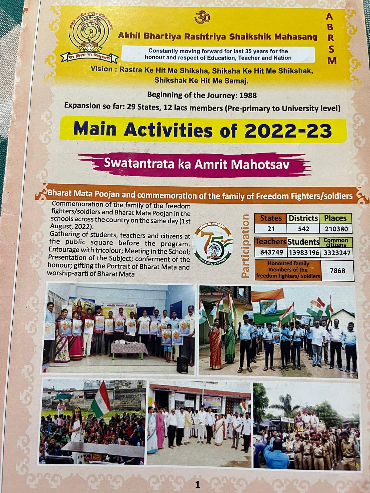
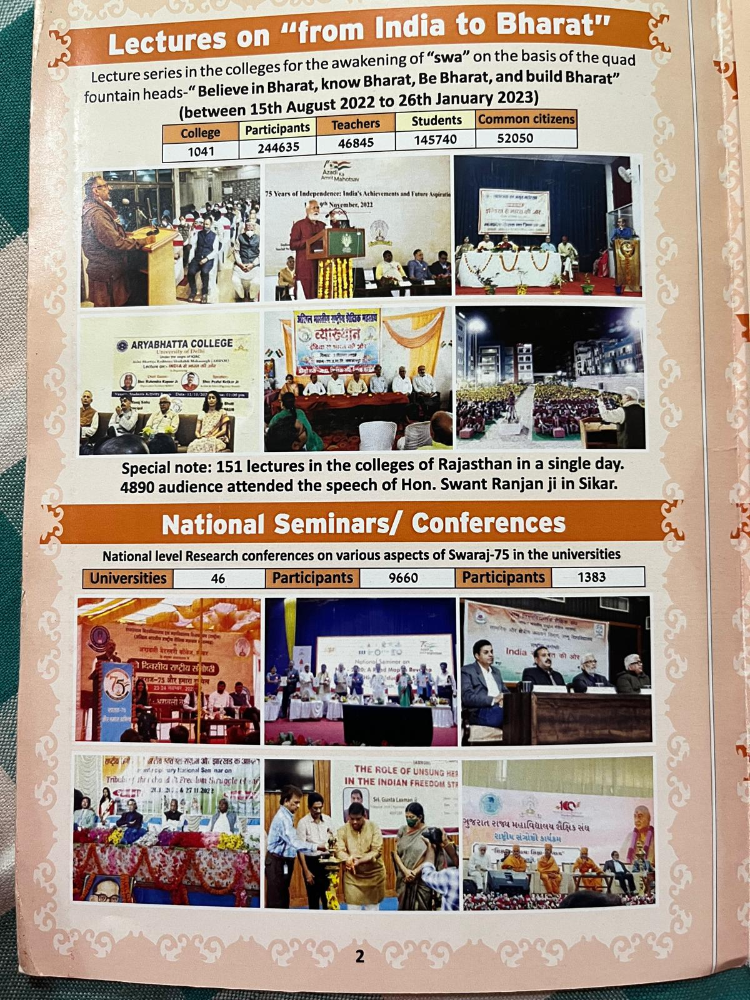

# Kalyani

## Task Set - 1____________`(8-July-2025)`

1. Create sections for below two images
2. Go Through the Instructions in the `📂 Instructions` folder on how to do it.
3. Any Doubt, Message me in the group or directly
4. From the below Images Create 
   1. Navigation Bar (Instructions in the `📂 Instructions` folder)
   2. Section 1: Image 1 Content (About Section, with Left side content and right side Bharatamata Image)
   3. Section 2: Image 2 Content
5. Go through `📂 Instructions` folder and also ask me for doubts.
6. Go through "new.aknu.edu.in" as Strong Example

|                                 |                                 |
| ------------------------------- | ------------------------------- |
|  |  |