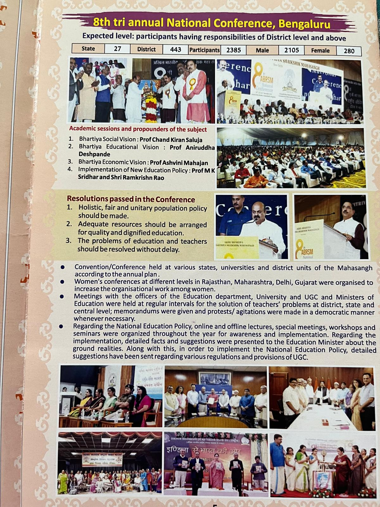
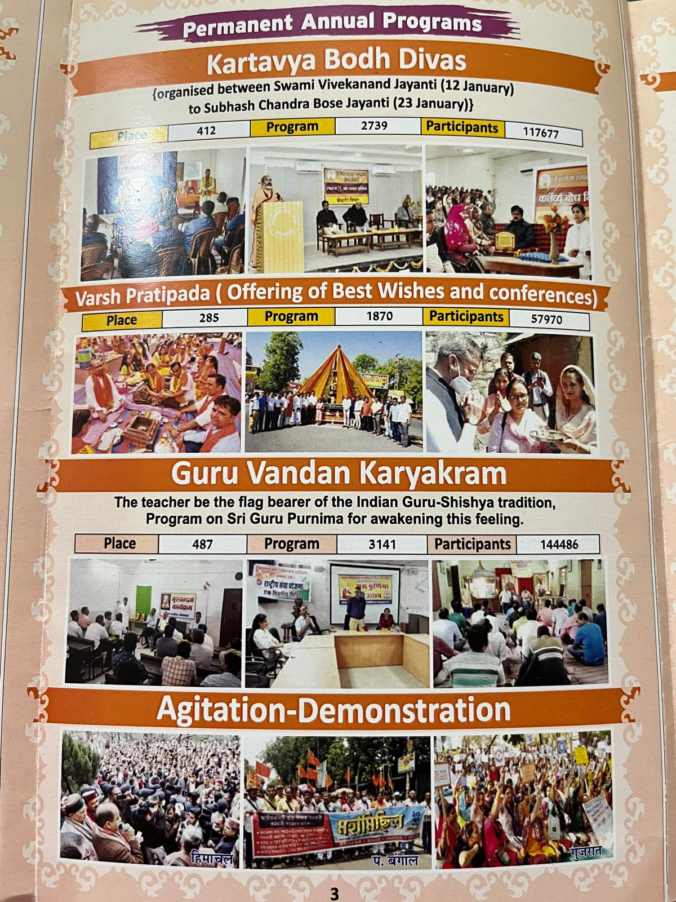
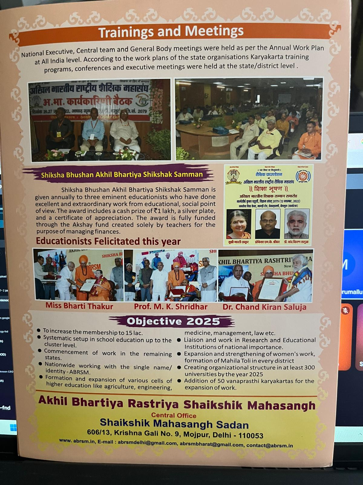

# Krupa

## Task Set - 1____________`(8-July-2025)`

1. Create sections for below two images
2. Go Through the Instructions in the `Instructions` folder on how to do it.
3. Any Doubt Message me in the group or directly
4. From the below Images Create 
   1. Section 1: Left Image Content
      1. The Headings, Tables, Sub-Headings, Points, 
      2. For now use some dummy Images from internet we will replace it later
   2. Section 2: RIght Image Content
      1. There are 4 sub sections
      2. 

|                                 |                                 |
| ------------------------------- | ------------------------------- |
|  |  |

## Task Set - 2____________`(9-July-2025)`

|                                 |
| ------------------------------- |
|  |